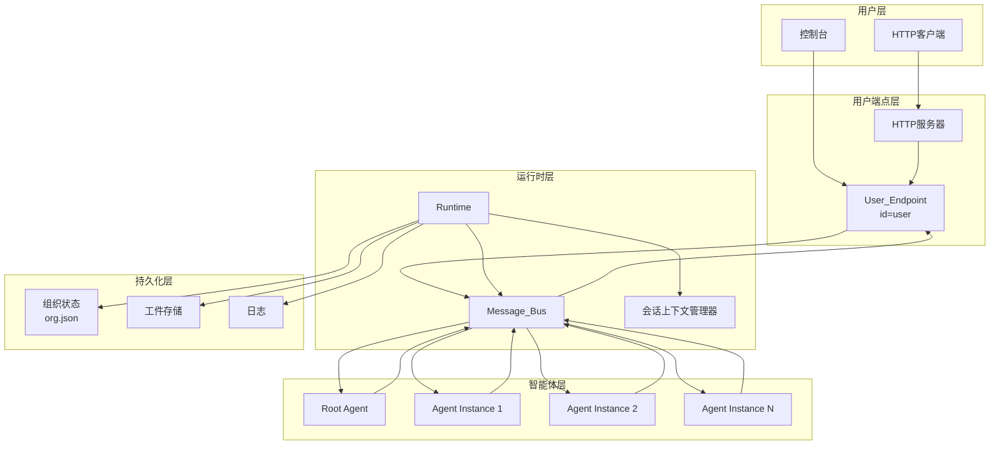
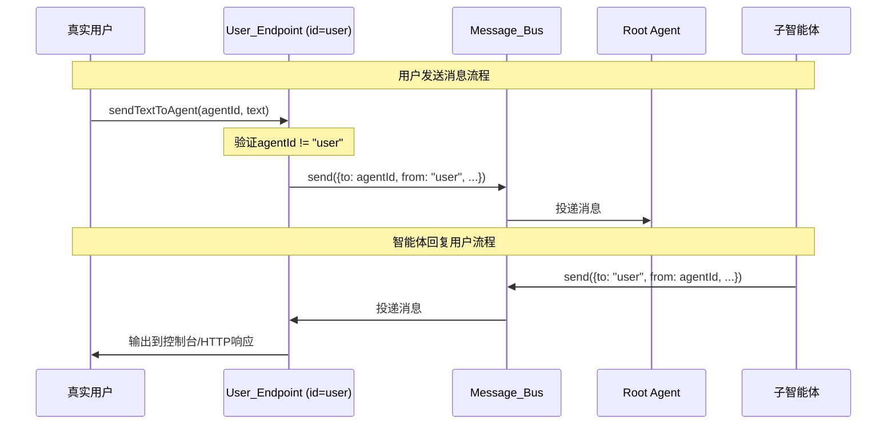

# 设计文档

## 概述

本设计文档描述自组织AI Agent社会系统优化的技术实现方案。主要包括：用户端点消息流转修复、HTTP服务支持、智能体终止与回收、会话上下文管理、错误恢复、可观测性增强、组织状态一致性和优雅关闭。

## 架构

### 整体架构图



### 消息流转图（修复后）



## 组件与接口

### 1. User_Endpoint 重构

```javascript
// 用户端点智能体 - 纯代码驱动
class UserEndpointAgent {
  constructor(options) {
    this.id = "user";
    this.messageHandlers = new Set(); // HTTP/控制台等输出处理器
  }
  
  // 处理真实用户发来的消息
  handleUserInput(targetAgentId, text, options = {}) {
    if (targetAgentId === "user") {
      throw new Error("不能向用户端点发送消息");
    }
    // 直接发送到目标智能体，不经过自己的队列
    this.bus.send({
      to: targetAgentId,
      from: "user",
      taskId: options.taskId,
      payload: { text }
    });
  }
  
  // 处理组织内智能体发来的消息（to="user"）
  async onMessage(ctx, message) {
    // 记录到收件箱
    this.inbox.push(message);
    // 通知所有输出处理器
    for (const handler of this.messageHandlers) {
      handler(message);
    }
  }
}
```

### 2. HTTP服务器

```javascript
// HTTP服务器组件
class HTTPServer {
  constructor(options) {
    this.port = options.port || 3000;
    this.userEndpoint = options.userEndpoint;
    this.server = null;
  }
  
  async start() {
    // POST /api/submit - 提交需求
    // POST /api/send - 发送消息到指定智能体
    // GET /api/messages/:taskId - 查询任务消息
    // GET /api/agents - 列出活跃智能体
  }
  
  async stop() {
    // 优雅关闭
  }
}
```

### 3. 智能体终止工具

```javascript
// 新增工具定义
{
  type: "function",
  function: {
    name: "terminate_agent",
    description: "终止指定的子智能体实例并回收资源。只能终止自己创建的子智能体。",
    parameters: {
      type: "object",
      properties: {
        agentId: { type: "string", description: "要终止的智能体ID" }
      },
      required: ["agentId"]
    }
  }
}

// 执行逻辑
async executeTerminateAgent(ctx, args) {
  const callerId = ctx.agent?.id;
  const targetId = args.agentId;
  
  // 验证是否为子智能体
  const targetMeta = this._agentMetaById.get(targetId);
  if (!targetMeta || targetMeta.parentAgentId !== callerId) {
    return { error: "只能终止自己创建的子智能体" };
  }
  
  // 处理待处理消息
  await this._drainAgentQueue(targetId);
  
  // 清理资源
  this._agents.delete(targetId);
  this._conversations.delete(targetId);
  this._agentMetaById.delete(targetId);
  
  // 持久化终止事件
  await this.org.recordTermination(targetId);
  
  return { ok: true, terminatedAgentId: targetId };
}
```

### 4. 会话上下文管理

```javascript
// 新增工具定义
{
  type: "function",
  function: {
    name: "compress_context",
    description: "压缩会话历史，保留系统提示词、最近消息和指定的重要内容摘要。当感知到上下文过长时调用。",
    parameters: {
      type: "object",
      properties: {
        summary: { 
          type: "string", 
          description: "对被压缩历史的重要内容摘要" 
        },
        keepRecentCount: { 
          type: "number", 
          description: "保留最近多少条消息，默认10" 
        }
      },
      required: ["summary"]
    }
  }
}

// 会话上下文管理器
class ConversationManager {
  constructor(options) {
    this.maxContextMessages = options.maxContextMessages || 50;
    this.conversations = new Map();
  }
  
  // 压缩上下文
  compress(agentId, summary, keepRecentCount = 10) {
    const conv = this.conversations.get(agentId);
    if (!conv || conv.length <= keepRecentCount + 1) return;
    
    const systemPrompt = conv[0]; // 保留系统提示词
    const recentMessages = conv.slice(-keepRecentCount);
    
    // 创建压缩后的上下文
    const compressed = [
      systemPrompt,
      { 
        role: "system", 
        content: `[历史摘要] ${summary}` 
      },
      ...recentMessages
    ];
    
    this.conversations.set(agentId, compressed);
  }
  
  // 检查是否需要警告
  checkAndWarn(agentId) {
    const conv = this.conversations.get(agentId);
    if (conv && conv.length > this.maxContextMessages) {
      return {
        warning: true,
        currentCount: conv.length,
        maxCount: this.maxContextMessages
      };
    }
    return { warning: false };
  }
}
```

### 5. 错误恢复

```javascript
// LLM调用重试逻辑
async callLLMWithRetry(params, maxRetries = 3) {
  let lastError = null;
  for (let i = 0; i < maxRetries; i++) {
    try {
      return await this.llm.chat(params);
    } catch (err) {
      lastError = err;
      const delay = Math.pow(2, i) * 1000; // 指数退避
      await new Promise(r => setTimeout(r, delay));
      this.log.warn("LLM调用失败，重试中", { 
        attempt: i + 1, 
        maxRetries, 
        delay,
        error: err.message 
      });
    }
  }
  throw lastError;
}
```

### 6. 优雅关闭

```javascript
// 信号处理
setupGracefulShutdown() {
  const shutdown = async (signal) => {
    this.log.info("收到关闭信号", { signal });
    this._stopRequested = true;
    
    // 等待当前处理完成
    const timeout = 30000;
    const start = Date.now();
    while (this._processingLoopPromise && Date.now() - start < timeout) {
      await new Promise(r => setTimeout(r, 100));
    }
    
    // 持久化状态
    await this.org.persist();
    
    // 关闭HTTP服务器
    if (this.httpServer) {
      await this.httpServer.stop();
    }
    
    this.log.info("关闭完成", {
      pendingMessages: this.bus.getPendingCount()
    });
    
    process.exit(0);
  };
  
  process.on("SIGINT", () => shutdown("SIGINT"));
  process.on("SIGTERM", () => shutdown("SIGTERM"));
}
```

## 数据模型

### 组织状态扩展

```json
{
  "roles": [
    {
      "id": "uuid",
      "name": "岗位名",
      "rolePrompt": "岗位提示词",
      "createdBy": "创建者智能体ID",
      "createdAt": "ISO时间戳"
    }
  ],
  "agents": [
    {
      "id": "uuid",
      "roleId": "岗位ID",
      "parentAgentId": "父智能体ID",
      "createdAt": "ISO时间戳",
      "terminatedAt": "ISO时间戳或null",
      "status": "active|terminated"
    }
  ],
  "terminations": [
    {
      "agentId": "uuid",
      "terminatedBy": "父智能体ID",
      "terminatedAt": "ISO时间戳",
      "reason": "终止原因"
    }
  ]
}
```

### HTTP API

```
POST /api/submit
请求: { "text": "需求描述" }
响应: { "taskId": "uuid" }

POST /api/send
请求: { "agentId": "目标智能体ID", "text": "消息内容", "taskId": "可选" }
响应: { "messageId": "uuid" }

GET /api/messages/:taskId
响应: { "messages": [...] }

GET /api/agents
响应: { "agents": [{ "id", "roleId", "roleName", "status" }] }
```


## 正确性属性

*正确性属性是一种在所有有效执行中都应保持为真的特征或行为——本质上是关于系统应该做什么的形式化陈述。属性作为人类可读规范和机器可验证正确性保证之间的桥梁。*

### Property 1: 用户端点输入验证

*对于任意* 用户发送的消息，如果目标智能体ID为"user"，则应被拒绝并返回错误；如果目标智能体ID为其他有效ID（如"root"或已存在的智能体ID），则应被接受并转发。

**验证: 需求 1.1, 1.4**

### Property 2: 用户端点消息流转正确性

*对于任意* 用户通过User_Endpoint发送的消息，消息总线中不应出现from="user"且to="user"的消息记录；所有用户发送的消息应直接发送到目标智能体。

**验证: 需求 1.2**

### Property 3: 用户消息接收完整性

*对于任意* 组织内智能体发送到to="user"的消息，User_Endpoint应接收该消息并将其添加到收件箱，且所有注册的输出处理器都应被调用。

**验证: 需求 1.3**

### Property 4: HTTP API消息转发一致性

*对于任意* 通过HTTP API发送的消息（submit或send），应产生与控制台方式相同的消息转发行为，且返回的taskId/messageId应与实际发送的消息对应。

**验证: 需求 2.2, 2.3**

### Property 5: HTTP消息查询完整性

*对于任意* taskId，通过GET /api/messages/{taskId}查询返回的消息列表应包含所有该taskId下用户收到的消息，且顺序与接收顺序一致。

**验证: 需求 2.4**

### Property 6: 智能体终止完整性

*对于任意* 被终止的智能体，终止后应满足：(1)不在活跃智能体注册表中，(2)会话上下文已被清理，(3)终止事件已持久化到组织状态。

**验证: 需求 3.1, 3.2, 3.3**

### Property 7: 智能体终止权限验证

*对于任意* terminate_agent调用，只有当调用者是目标智能体的父智能体时才应成功；否则应返回错误。

**验证: 需求 3.4**

### Property 8: 智能体终止前消息处理

*对于任意* 被终止的智能体，如果其队列中有待处理消息，这些消息应在智能体被移除前被处理完毕。

**验证: 需求 3.5**

### Property 9: 上下文压缩保留性

*对于任意* compress_context调用，压缩后的上下文应保留：(1)原始系统提示词，(2)指定数量的最近消息，(3)调用者提供的摘要内容。

**验证: 需求 4.2**

### Property 10: 上下文超限警告

*对于任意* 智能体的会话上下文，当消息数量超过max_context_messages时，应向智能体发出警告。

**验证: 需求 4.3**

### Property 11: LLM调用重试行为

*对于任意* 失败的LLM调用，Runtime应按指数退避策略重试，重试次数不超过3次，每次重试的延迟应为2^n秒（n为重试次数）。

**验证: 需求 5.1**

### Property 12: 智能体错误隔离

*对于任意* 智能体消息处理器抛出的异常，不应影响其他智能体的消息处理；Runtime应继续处理其他智能体的消息。

**验证: 需求 5.2**

### Property 13: 组织状态持久化一致性

*对于任意* 创建的岗位或智能体，创建操作完成后立即读取持久化文件应能获取到该记录；加载时应验证数据结构的完整性。

**验证: 需求 7.1, 7.2**

### Property 14: 优雅关闭完整性

*对于任意* 关闭信号（SIGINT/SIGTERM），Runtime应：(1)停止接收新消息，(2)等待当前处理完成（最多30秒），(3)持久化状态，(4)记录关闭摘要。

**验证: 需求 8.1, 8.2, 8.3, 8.4**

## 错误处理

### LLM调用错误

- 网络超时：指数退避重试，最多3次
- API错误（4xx/5xx）：记录错误，重试或向父智能体报告
- 响应解析错误：记录原始响应，返回错误给智能体

### 消息处理错误

- 智能体处理器异常：捕获异常，记录日志，继续处理其他智能体
- 工具调用错误：将错误包含在会话上下文中，让LLM决定下一步

### 持久化错误

- 写入失败：重试一次，仍失败则记录错误并继续运行
- 读取失败：记录错误，以空状态启动

### HTTP服务错误

- 端口占用：记录错误，继续以控制台模式运行
- 请求处理错误：返回适当的HTTP错误码和错误信息

## 测试策略

### 单元测试

- User_Endpoint输入验证逻辑
- 消息转发逻辑
- terminate_agent权限验证
- compress_context保留逻辑
- 重试延迟计算

### 属性测试

使用 fast-check 库进行属性测试，每个属性至少运行100次迭代。

测试框架配置：
```javascript
// 使用 Bun 测试框架 + fast-check
import { test, expect } from "bun:test";
import fc from "fast-check";
```

属性测试重点：
1. 用户端点输入验证（Property 1）
2. 消息流转正确性（Property 2）
3. 智能体终止完整性（Property 6）
4. 上下文压缩保留性（Property 9）
5. 组织状态持久化一致性（Property 13）

### 集成测试

- 完整的用户消息发送-接收流程
- HTTP API端到端测试
- 智能体创建-执行-终止生命周期
- 系统启动-运行-关闭流程

