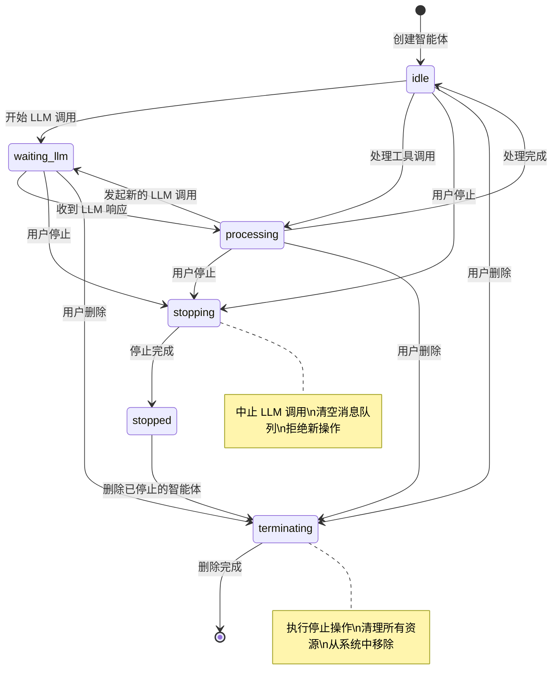
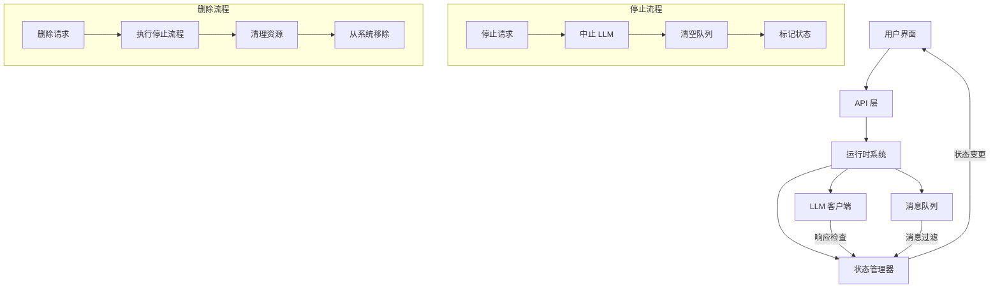

# Design Document

## Overview

本设计文档描述了智能体停止处理功能的技术实现方案。系统将引入新的智能体状态管理机制，确保停止和删除操作的原子性和彻底性，防止已停止或已删除的智能体继续处理消息或与 LLM 通信。

核心设计原则：
1. **立即性** - 停止操作必须立即生效，不允许延迟
2. **彻底性** - 停止后不能有任何残留的处理或通信
3. **原子性** - 停止操作必须是原子的，避免竞态条件
4. **级联性** - 父智能体停止时，所有子智能体也必须停止

## Architecture

### 状态管理架构



### 组件交互架构



## Components and Interfaces

### 1. 智能体状态管理器 (AgentStateManager)

负责管理智能体的生命周期状态，确保状态转换的原子性。

```javascript
class AgentStateManager {
  constructor() {
    this._agentStates = new Map(); // agentId -> state
    this._stateLocks = new Map();  // agentId -> lock
  }

  /**
   * 获取智能体当前状态
   * @param {string} agentId 
   * @returns {'idle'|'waiting_llm'|'processing'|'stopping'|'stopped'|'terminating'}
   */
  getState(agentId) {}

  /**
   * 原子性地设置智能体状态
   * @param {string} agentId 
   * @param {string} newState 
   * @param {string} [expectedCurrentState] - 期望的当前状态，用于 CAS 操作
   * @returns {boolean} 是否成功设置
   */
  setState(agentId, newState, expectedCurrentState = null) {}

  /**
   * 检查智能体是否可以处理新操作
   * @param {string} agentId 
   * @returns {boolean}
   */
  canProcessOperations(agentId) {}

  /**
   * 检查智能体是否已停止或正在停止
   * @param {string} agentId 
   * @returns {boolean}
   */
  isStopped(agentId) {}
}
```

### 2. 停止操作管理器 (StopOperationManager)

负责执行智能体的停止和删除操作。

```javascript
class StopOperationManager {
  constructor(runtime, stateManager, llmClient) {
    this.runtime = runtime;
    this.stateManager = stateManager;
    this.llmClient = llmClient;
  }

  /**
   * 停止智能体（保留智能体，但停止所有活动）
   * @param {string} agentId 
   * @returns {Promise<{ok: boolean, stopped: boolean, reason?: string}>}
   */
  async stopAgent(agentId) {}

  /**
   * 删除智能体（彻底移除）
   * @param {string} agentId 
   * @param {string} callerId - 调用者 ID
   * @param {string} [reason] - 删除原因
   * @returns {Promise<{ok: boolean, terminated: boolean, error?: string}>}
   */
  async terminateAgent(agentId, callerId, reason) {}

  /**
   * 级联停止所有子智能体
   * @param {string} parentAgentId 
   * @returns {Promise<string[]>} 被停止的智能体 ID 列表
   */
  async cascadeStop(parentAgentId) {}

  /**
   * 级联删除所有子智能体
   * @param {string} parentAgentId 
   * @returns {Promise<string[]>} 被删除的智能体 ID 列表
   */
  async cascadeTerminate(parentAgentId) {}
}
```

### 3. 消息队列管理器 (MessageQueueManager)

负责管理智能体的消息队列，支持基于状态的消息过滤。

```javascript
class MessageQueueManager {
  constructor(stateManager) {
    this.stateManager = stateManager;
    this._queues = new Map(); // agentId -> Queue
  }

  /**
   * 向智能体队列添加消息（会检查状态）
   * @param {string} agentId 
   * @param {object} message 
   * @returns {boolean} 是否成功添加
   */
  enqueue(agentId, message) {}

  /**
   * 从智能体队列获取消息（会检查状态）
   * @param {string} agentId 
   * @returns {object|null}
   */
  dequeue(agentId) {}

  /**
   * 清空智能体的消息队列
   * @param {string} agentId 
   * @returns {number} 被清空的消息数量
   */
  clearQueue(agentId) {}

  /**
   * 获取队列长度
   * @param {string} agentId 
   * @returns {number}
   */
  getQueueLength(agentId) {}
}
```

### 4. LLM 响应过滤器 (LLMResponseFilter)

负责过滤已停止智能体的 LLM 响应。

```javascript
class LLMResponseFilter {
  constructor(stateManager) {
    this.stateManager = stateManager;
  }

  /**
   * 检查是否应该处理 LLM 响应
   * @param {string} agentId 
   * @param {object} response 
   * @returns {boolean}
   */
  shouldProcessResponse(agentId, response) {}

  /**
   * 丢弃 LLM 响应并记录日志
   * @param {string} agentId 
   * @param {object} response 
   * @param {string} reason 
   */
  discardResponse(agentId, response, reason) {}
}
```

## Data Models

### 智能体状态枚举

```javascript
const AgentState = {
  IDLE: 'idle',                    // 空闲状态，可以接收新消息
  WAITING_LLM: 'waiting_llm',      // 等待 LLM 响应
  PROCESSING: 'processing',        // 处理工具调用或其他操作
  STOPPING: 'stopping',            // 正在停止（过渡状态）
  STOPPED: 'stopped',              // 已停止，不处理任何操作
  TERMINATING: 'terminating'       // 正在删除（过渡状态）
};
```

### 停止操作结果

```javascript
/**
 * @typedef {Object} StopResult
 * @property {boolean} ok - 操作是否成功
 * @property {boolean} stopped - 是否实际执行了停止
 * @property {string} [reason] - 未停止的原因
 * @property {string[]} [cascadeStopped] - 级联停止的智能体 ID 列表
 */
```

### 删除操作结果

```javascript
/**
 * @typedef {Object} TerminateResult
 * @property {boolean} ok - 操作是否成功
 * @property {boolean} terminated - 是否实际执行了删除
 * @property {string} [error] - 错误信息
 * @property {string} [terminatedAgentId] - 被删除的智能体 ID
 * @property {string[]} [cascadeTerminated] - 级联删除的智能体 ID 列表
 */
```

## Correctness Properties

*A property is a characteristic or behavior that should hold true across all valid executions of a system-essentially, a formal statement about what the system should do. Properties serve as the bridge between human-readable specifications and machine-verifiable correctness guarantees.*

现在我需要使用 prework 工具来分析需求中的接受标准，以便生成正确的属性：

基于需求分析，以下是核心的正确性属性：

### Property 1: 停止操作立即中止 LLM 请求
*For any* 智能体，当执行停止或删除操作时，该智能体的所有活动 LLM 请求应该被立即中止
**Validates: Requirements 1.1, 3.1**

### Property 2: 停止后状态正确设置
*For any* 智能体，当执行停止操作时，智能体状态应该被设置为 "stopped"
**Validates: Requirements 2.1**

### Property 3: 停止操作清空消息队列
*For any* 智能体，当执行停止或删除操作时，该智能体的消息队列应该被完全清空
**Validates: Requirements 1.3, 6.1**

### Property 4: 已停止智能体拒绝新消息
*For any* 处于 "stopped" 状态的智能体，系统应该拒绝处理该智能体的所有新消息
**Validates: Requirements 2.2, 2.3**

### Property 5: 停止和删除操作不发送通知
*For any* 智能体，当执行停止或删除操作时，系统不应该向任何其他智能体发送通知消息
**Validates: Requirements 2.4, 3.5, 4.4**

### Property 6: 已停止或已删除智能体丢弃 LLM 响应
*For any* 已停止或已删除的智能体，如果收到 LLM 响应，系统应该丢弃该响应而不进行任何处理
**Validates: Requirements 1.4, 3.4**

### Property 7: 删除操作移除所有注册信息
*For any* 智能体，当执行删除操作时，该智能体应该从运行时系统的所有注册表和映射表中被移除
**Validates: Requirements 3.3, 6.5**

### Property 8: 级联停止子智能体
*For any* 父智能体，当执行停止操作时，所有子智能体也应该被递归停止
**Validates: Requirements 4.1**

### Property 9: 级联删除子智能体
*For any* 父智能体，当执行删除操作时，所有子智能体也应该被递归删除
**Validates: Requirements 4.2**

### Property 10: 级联操作一致性
*For any* 智能体，级联停止或删除的行为应该与直接停止或删除的行为完全一致
**Validates: Requirements 4.3**

### Property 11: 停止操作原子性
*For any* 智能体，停止操作应该是原子的，多个并发停止请求应该只执行一次实际的停止操作
**Validates: Requirements 5.1, 5.4**

### Property 12: 正在停止状态拒绝新操作
*For any* 处于 "stopping" 状态的智能体，系统应该拒绝该智能体的所有新操作请求
**Validates: Requirements 5.2**

### Property 13: 停止操作优先级
*For any* 智能体，如果停止操作与 LLM 响应同时发生，停止操作应该优先执行
**Validates: Requirements 5.5**

### Property 14: 异步操作取消
*For any* 智能体，当执行停止操作时，该智能体的所有待处理异步操作应该被取消
**Validates: Requirements 6.2**

### Property 15: 删除操作清理资源
*For any* 智能体，当执行删除操作时，该智能体的所有内存状态和持久化数据应该被清理
**Validates: Requirements 6.3, 6.4**

## Error Handling

### 停止操作错误处理

1. **智能体不存在** - 返回错误信息，不执行任何操作
2. **权限不足** - 验证调用者权限，拒绝未授权的停止请求
3. **状态冲突** - 如果智能体已经在停止或删除过程中，返回相应状态
4. **LLM 中止失败** - 记录警告日志，但继续执行停止流程
5. **级联操作部分失败** - 记录失败的子智能体，但不回滚已成功的操作

### 删除操作错误处理

1. **智能体不存在** - 返回错误信息，不执行任何操作
2. **权限验证失败** - 只允许父智能体删除子智能体
3. **资源清理失败** - 记录错误日志，但继续删除流程
4. **持久化数据删除失败** - 记录错误，但不阻止内存清理
5. **级联删除部分失败** - 记录失败信息，继续处理其他子智能体

### 竞态条件处理

1. **并发停止请求** - 使用状态锁确保只执行一次
2. **停止与消息处理竞争** - 停止操作优先，丢弃后续消息
3. **删除与 LLM 响应竞争** - 删除操作优先，丢弃 LLM 响应
4. **状态检查与状态变更竞争** - 使用原子操作确保一致性

## Testing Strategy

### 双重测试方法

本功能将采用单元测试和基于属性的测试相结合的方法：

- **单元测试**: 验证特定场景、边界条件和错误处理
- **基于属性的测试**: 验证跨所有输入的通用属性

### 单元测试重点

1. **特定场景测试**:
   - 停止空闲状态的智能体
   - 停止等待 LLM 响应的智能体
   - 停止正在处理的智能体
   - 删除已停止的智能体

2. **边界条件测试**:
   - 停止不存在的智能体
   - 删除没有子智能体的智能体
   - 处理空消息队列的智能体

3. **错误条件测试**:
   - LLM 中止失败的情况
   - 权限验证失败
   - 资源清理失败

### 基于属性的测试配置

- **测试框架**: 使用 JavaScript 的 fast-check 库
- **测试迭代**: 每个属性测试最少 100 次迭代
- **测试标签**: 每个测试使用格式 **Feature: agent-stop-processing, Property {number}: {property_text}**

### 测试数据生成策略

1. **智能体生成器**: 生成具有不同状态、消息队列长度和子智能体的随机智能体
2. **智能体树生成器**: 生成具有多层级关系的智能体树结构
3. **消息生成器**: 生成不同类型和优先级的随机消息
4. **并发场景生成器**: 生成并发操作的测试场景

### 集成测试

1. **端到端流程测试**: 从 UI 操作到后端处理的完整流程
2. **性能测试**: 大量智能体的停止和删除操作性能
3. **压力测试**: 高并发场景下的系统稳定性
4. **恢复测试**: 系统重启后的状态一致性