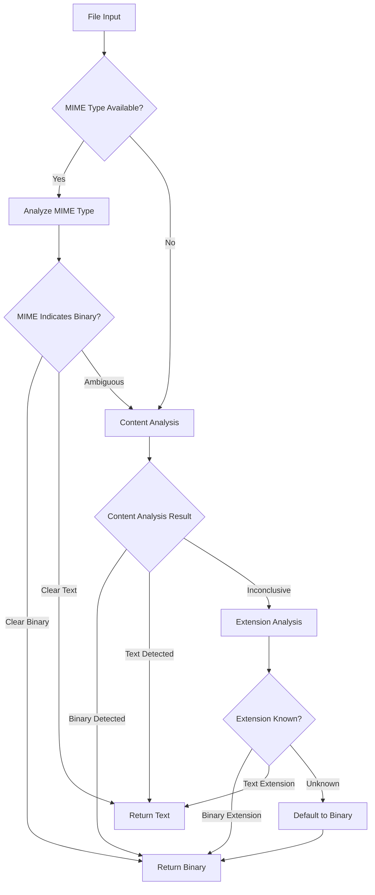

# Design Document: Enhanced Binary Detection for Artifact Store

## Overview

This design enhances the artifact storage system's binary file detection by implementing a multi-layered approach that prioritizes MIME types, uses content analysis, and maintains comprehensive extension-based fallback. The solution addresses the current limitation of relying solely on incomplete file extension lists.

## Architecture

The enhanced binary detection system follows a hierarchical detection strategy:

1. **MIME Type Analysis** (Primary) - Uses provided MIME types to determine binary vs text
2. **Content Analysis** (Secondary) - Analyzes file content using magic bytes and character encoding
3. **Enhanced Extension Detection** (Fallback) - Comprehensive extension-based classification
4. **Safe Default** (Final) - Defaults to binary handling when uncertain



## Components and Interfaces

### BinaryDetector Class

The core detection logic will be encapsulated in a new `BinaryDetector` class:

```javascript
class BinaryDetector {
  /**
   * Determines if content is binary using multi-layered detection
   * @param {Buffer} buffer - File content buffer
   * @param {Object} options - Detection options
   * @param {string} [options.mimeType] - MIME type if available
   * @param {string} [options.filename] - Original filename
   * @param {string} [options.extension] - File extension
   * @returns {Promise<DetectionResult>}
   */
  async detectBinary(buffer, options = {}) {}
  
  /**
   * Analyzes MIME type for binary classification
   * @param {string} mimeType - MIME type to analyze
   * @returns {BinaryClassification}
   */
  analyzeMimeType(mimeType) {}
  
  /**
   * Performs content-based binary detection
   * @param {Buffer} buffer - Content to analyze
   * @returns {Promise<BinaryClassification>}
   */
  async analyzeContent(buffer) {}
  
  /**
   * Enhanced extension-based detection
   * @param {string} extension - File extension
   * @returns {BinaryClassification}
   */
  analyzeExtension(extension) {}
}
```

### Detection Result Types

```javascript
/**
 * @typedef {Object} DetectionResult
 * @property {boolean} isBinary - Whether content is binary
 * @property {string} method - Detection method used
 * @property {number} confidence - Confidence level (0-1)
 * @property {string} [detectedMimeType] - MIME type detected from content
 * @property {Object} metadata - Additional detection metadata
 */

/**
 * @typedef {Object} BinaryClassification
 * @property {'binary'|'text'|'ambiguous'} classification
 * @property {number} confidence - Confidence level (0-1)
 * @property {string} reason - Reason for classification
 */
```

### Enhanced ArtifactStore Integration

The existing `ArtifactStore` class will be updated to use the new detection system:

```javascript
// Replace the current _isBinaryExtension method
async _detectBinary(buffer, options = {}) {
  if (!this.binaryDetector) {
    this.binaryDetector = new BinaryDetector({
      logger: this.log
    });
  }
  
  return await this.binaryDetector.detectBinary(buffer, options);
}
```

## Data Models

### MIME Type Classification Maps

```javascript
const MIME_CLASSIFICATIONS = {
  // Definitive binary types
  BINARY_TYPES: new Set([
    'image/', 'video/', 'audio/', 'font/',
    'application/pdf', 'application/zip', 'application/octet-stream'
  ]),
  
  // Definitive text types  
  TEXT_TYPES: new Set([
    'text/', 'application/json', 'application/xml',
    'application/javascript', 'application/typescript'
  ]),
  
  // Ambiguous types requiring content analysis
  AMBIGUOUS_TYPES: new Set([
    'application/octet-stream', 'application/unknown'
  ])
};
```

### Enhanced Extension Maps

```javascript
const EXTENSION_CLASSIFICATIONS = {
  BINARY_EXTENSIONS: new Set([
    // Images
    '.png', '.jpg', '.jpeg', '.gif', '.webp', '.bmp', '.avif', '.ico', '.svg',
    '.tiff', '.tif', '.raw', '.cr2', '.nef', '.arw', '.dng',
    
    // Documents
    '.pdf', '.doc', '.docx', '.xls', '.xlsx', '.ppt', '.pptx',
    '.odt', '.ods', '.odp', '.rtf',
    
    // Archives
    '.zip', '.rar', '.7z', '.tar', '.gz', '.bz2', '.xz', '.lz4',
    '.cab', '.iso', '.dmg',
    
    // Media
    '.mp3', '.mp4', '.wav', '.avi', '.mov', '.webm', '.mkv',
    '.flac', '.ogg', '.m4a', '.aac', '.wma',
    
    // Executables
    '.exe', '.dll', '.so', '.dylib', '.app', '.deb', '.rpm',
    '.msi', '.pkg', '.dmg',
    
    // Fonts
    '.woff', '.woff2', '.ttf', '.otf', '.eot',
    
    // Other binary formats
    '.bin', '.dat', '.db', '.sqlite', '.sqlite3'
  ]),
  
  TEXT_EXTENSIONS: new Set([
    // Code files
    '.js', '.mjs', '.ts', '.tsx', '.jsx', '.py', '.java', '.c', '.cpp',
    '.h', '.hpp', '.cs', '.php', '.rb', '.go', '.rs', '.swift',
    '.kt', '.scala', '.clj', '.hs', '.ml', '.fs', '.vb',
    
    // Markup and data
    '.html', '.htm', '.xml', '.json', '.yaml', '.yml', '.toml',
    '.csv', '.tsv', '.ini', '.cfg', '.conf',
    
    // Documentation
    '.md', '.txt', '.rst', '.adoc', '.tex',
    
    // Scripts and config
    '.sh', '.bash', '.zsh', '.fish', '.ps1', '.bat', '.cmd',
    '.dockerfile', '.makefile', '.gitignore', '.gitattributes',
    
    // Web assets
    '.css', '.scss', '.sass', '.less', '.styl',
    
    // Logs and data
    '.log', '.out', '.err', '.trace'
  ])
};
```

## Correctness Properties

Let me analyze the acceptance criteria for testable properties:

<function_calls>
<invoke name="prework">
<parameter name="featureName">artifact-binary-detection

*A property is a characteristic or behavior that should hold true across all valid executions of a system-essentially, a formal statement about what the system should do. Properties serve as the bridge between human-readable specifications and machine-verifiable correctness guarantees.*

After analyzing the acceptance criteria, I've identified several properties that can be consolidated to avoid redundancy:

**Property Reflection:**
- Properties 1.2 and 1.3 can be combined into a single comprehensive MIME type classification property
- Properties 2.2 and 2.3 can be combined into a single content analysis property
- Properties 6.1, 6.2, and 6.3 can be combined into a comprehensive logging property
- Several properties about fallback behavior can be consolidated

### Property 1: MIME Type Priority and Classification
*For any* file with a valid MIME type, the detection system should use MIME type analysis as the primary method and correctly classify binary MIME types (image/*, application/pdf, etc.) as binary and text MIME types (text/*, application/json, etc.) as text.
**Validates: Requirements 1.1, 1.2, 1.3**

### Property 2: Content Analysis Accuracy
*For any* file content, when content analysis is performed, files containing null bytes or non-printable characters should be classified as binary, while valid UTF-8 text content should be classified as text.
**Validates: Requirements 2.2, 2.3**

### Property 3: Fallback Chain Integrity
*For any* file, when MIME type analysis is unavailable or ambiguous, the system should fall back to content analysis, and when content analysis is inconclusive, it should fall back to extension detection.
**Validates: Requirements 1.4, 2.1, 3.1**

### Property 4: Safe Default Behavior
*For any* file with unknown extension or inconclusive analysis, the system should default to binary handling for safety.
**Validates: Requirements 2.4, 3.4**

### Property 5: Extension Classification Completeness
*For any* common file extension, the enhanced extension detection should correctly classify it as binary or text according to the comprehensive extension maps.
**Validates: Requirements 3.2**

### Property 6: Backward Compatibility Preservation
*For any* existing artifact reference, the enhanced detection system should maintain compatibility and apply new detection logic while preserving access to existing artifacts.
**Validates: Requirements 4.1, 4.3**

### Property 7: Metadata Enhancement
*For any* existing artifact lacking MIME type information, the system should infer and enhance the metadata from available data without breaking existing functionality.
**Validates: Requirements 4.2**

### Property 8: Conflict Resolution and Logging
*For any* detection operation, the system should log the detection method used and result, and when detection methods disagree, it should log the conflict and resolution with all required details.
**Validates: Requirements 4.4, 6.1, 6.2, 6.3**

### Property 9: Performance Consistency
*For any* file under 1MB, binary detection should complete within 10ms and produce deterministic, consistent results across multiple calls.
**Validates: Requirements 5.1, 5.2**

### Property 10: Error Handling and Caching
*For any* detection operation, errors should be logged with fallback to safe binary handling, and repeated detection of identical content should use cached results.
**Validates: Requirements 5.3, 5.4**

### Property 11: Debug Logging Detail
*For any* detection operation when debug logging is enabled, the system should provide detailed analysis information including all attempted methods and their results.
**Validates: Requirements 6.4**

## Error Handling

The enhanced detection system implements comprehensive error handling:

1. **MIME Type Parsing Errors**: Invalid MIME types are logged and trigger fallback to content analysis
2. **Content Analysis Errors**: File read errors or analysis failures default to binary classification
3. **Extension Detection Errors**: Malformed extensions are treated as unknown and default to binary
4. **Performance Timeouts**: Detection operations exceeding time limits default to binary with logging
5. **Memory Constraints**: Large files use streaming analysis to prevent memory issues

## Testing Strategy

The testing approach combines unit tests for specific scenarios with property-based tests for comprehensive coverage:

### Unit Testing
- Specific MIME type classifications
- Known binary and text file formats
- Error conditions and edge cases
- Performance benchmarks with known file sizes
- Integration with existing artifact storage

### Property-Based Testing
- Random MIME type generation and classification verification
- Random content generation with known binary/text characteristics
- Fallback chain testing with various input combinations
- Consistency testing across multiple detection runs
- Caching behavior verification

**Property Test Configuration:**
- Minimum 100 iterations per property test
- Each test tagged with format: **Feature: artifact-binary-detection, Property {number}: {property_text}**
- Use fast-check library for JavaScript property-based testing
- Generate diverse test data including edge cases and boundary conditions

**Testing Libraries:**
- **Jest** for unit testing framework
- **fast-check** for property-based testing
- **file-type** npm package for magic byte detection reference
- Custom generators for MIME types, file extensions, and content patterns