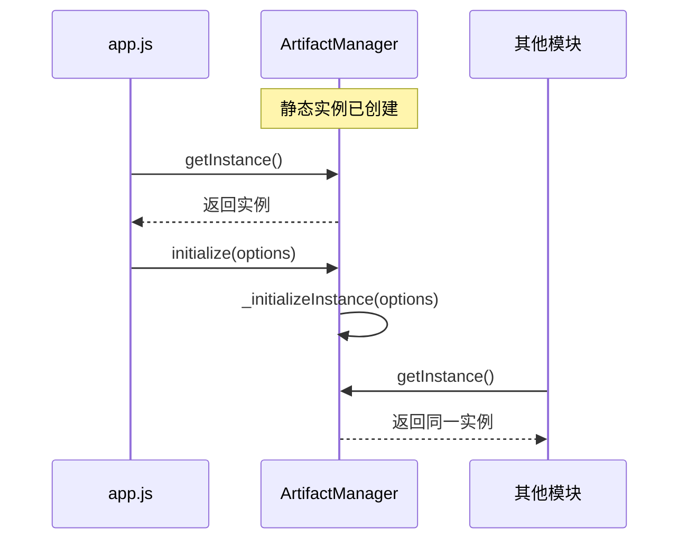

# ArtifactManager 严格单例模式设计文档

## 1. 设计概述

将 ArtifactManager 重构为严格的单例模式，确保全局只有一个实例。采用静态实例化和私有构造函数，禁止多实例创建。**严格遵守单例模式，不考虑向后兼容，这不是公共API**。

## 2. 架构设计

### 2.1 严格单例模式实现

```javascript
class ArtifactManager {
  // 静态实例 - 立即创建
  static #instance = new ArtifactManager();
  
  // 私有构造函数 - 防止外部直接实例化
  constructor() {
    // 严格检查：如果已有实例，抛出错误
    if (ArtifactManager.#instance) {
      throw new Error('ArtifactManager 是单例模式，请使用 ArtifactManager.getInstance() 获取实例');
    }
    
    // 基础属性初始化
    this.container = null;
    this.windowEl = null;
    this.api = null;
    this.logger = null;
    this.artifacts = [];
    this.selectedArtifact = null;
    this.isViewerOpen = false;
    this.isInitialized = false;
  }
  
  // 静态工厂方法 - 唯一的实例获取方式
  static getInstance() {
    return ArtifactManager.#instance;
  }
  
  // 公共初始化方法 - 由 app.js 调用
  initialize(options = {}) {
    if (this.isInitialized) {
      console.warn('ArtifactManager 已经初始化，忽略重复初始化');
      return;
    }
    
    this._initializeInstance(options);
    this.isInitialized = true;
  }
  
  // 私有初始化方法
  _initializeInstance(options) {
    // 设置默认选项
    const defaultOptions = {
      container: document.getElementById("artifact-manager"),
      windowEl: document.getElementById("artifact-manager-window"),
      api: window.API,
      logger: console
    };
    
    // 合并选项
    const finalOptions = { ...defaultOptions, ...options };
    
    // 设置实例属性
    this.container = finalOptions.container;
    this.windowEl = finalOptions.windowEl;
    this.api = finalOptions.api;
    this.logger = finalOptions.logger;
    
    // 调用现有的 _init 方法
    this._init();
  }
  
}
```

### 2.2 调用方式设计

#### 2.2.1 唯一调用方式
```javascript
// 获取单例实例
const manager = ArtifactManager.getInstance();

// app.js 中初始化
const manager = ArtifactManager.getInstance();
manager.initialize({
  container: document.getElementById('artifact-manager'),
  windowEl: document.getElementById('artifact-manager-window'),
  api: API,
  logger: console
});
```

### 2.3 初始化流程设计



## 3. 详细设计

### 3.1 静态属性和方法

```javascript
class ArtifactManager {
  // 私有静态实例 - 立即创建
  static #instance = new ArtifactManager();
  
  /**
   * 获取单例实例
   * @returns {ArtifactManager} 单例实例
   */
  static getInstance() {
    return ArtifactManager.#instance;
  }

}
```

### 3.2 构造函数设计

```javascript
constructor() {
  // 严格单例检查：如果已有实例，抛出错误
  if (ArtifactManager.#instance) {
    throw new Error('ArtifactManager 是单例模式，请使用 ArtifactManager.getInstance() 获取实例');
  }
  
  // 基础属性初始化
  this.container = null;
  this.windowEl = null;
  this.api = null;
  this.logger = null;
  this.artifacts = [];
  this.selectedArtifact = null;
  this.isViewerOpen = false;
  this.isInitialized = false;
  
  // 其他基础属性
  this.pollTimer = null;
  this.thumbnailNavigator = null;
  this.headerEl = null;
  this._boundStartDragging = null;
}
```

### 3.3 初始化方法

```javascript
/**
 * 公共初始化方法
 * @param {Object} options - 初始化选项
 */
initialize(options = {}) {
  if (this.isInitialized) {
    console.warn('ArtifactManager 已经初始化，忽略重复初始化');
    return;
  }
  
  this._initializeInstance(options);
  this.isInitialized = true;
}

/**
 * 私有初始化方法
 * @param {Object} options - 初始化选项
 * @private
 */
_initializeInstance(options = {}) {
  // 设置默认选项
  const defaultOptions = {
    container: document.getElementById("artifact-manager"),
    windowEl: document.getElementById("artifact-manager-window"),
    api: window.API,
    logger: console
  };
  
  // 合并选项
  const finalOptions = { ...defaultOptions, ...options };
  
  // 验证必需的 DOM 元素
  if (!finalOptions.container) {
    throw new Error('ArtifactManager 容器元素不存在');
  }
  
  if (!finalOptions.windowEl) {
    throw new Error('ArtifactManager 窗口元素不存在');
  }
  
  // 设置实例属性
  this.container = finalOptions.container;
  this.windowEl = finalOptions.windowEl;
  this.api = finalOptions.api;
  this.logger = finalOptions.logger;
  
  // 调用现有的 _init 方法
  this._init();
}
```

### 3.4 清理方法

不需要

## 4. 模块集成设计

### 4.1 app.js 集成

```javascript
// app.js 中的修改
const App = {
  /**
   * 初始化应用
   */
  init() {
    // 初始化 ArtifactManager
    const artifactManager = ArtifactManager.getInstance();
    artifactManager.initialize({
      container: document.getElementById('artifact-manager'),
      windowEl: document.getElementById('artifact-manager-window'),
      api: API,
      logger: console
    });
    
    // 其他初始化逻辑...
  },
  
  /**
   * 打开工件管理器窗口
   */
  openArtifactManager() {
    const manager = ArtifactManager.getInstance();
    manager.show();
  }
};
```

### 4.2 chat-panel.mjs 集成

```javascript
// chat-panel.mjs 中的修改
_openArtifactWithManager(artifact) {
  try {
    // 使用单例模式获取实例
    const manager = ArtifactManager.getInstance();
    
    // 其余逻辑保持不变
    manager.openArtifact(artifact);
  } catch (err) {
    console.error('打开工件失败:', err);
    // 错误处理
  }
}
```

### 4.3 全局访问设计

禁止使用window全局访问，所有地方改为从单例函数获取。

## 5. 错误处理设计

### 5.1 初始化错误处理

```javascript
initialize(options = {}) {
  try {
    if (this.isInitialized) {
      console.warn('ArtifactManager 已经初始化，忽略重复初始化');
      return;
    }
    
    this._initializeInstance(options);
    this.isInitialized = true;
  } catch (error) {
    console.error('ArtifactManager 初始化失败:', error);
    throw error;
  }
}
```

### 5.2 DOM 元素检查

```javascript
_initializeInstance(options = {}) {
  // 检查必需的 DOM 元素
  const container = options.container || document.getElementById("artifact-manager");
  const windowEl = options.windowEl || document.getElementById("artifact-manager-window");
  
  if (!container) {
    throw new Error('ArtifactManager 容器元素不存在');
  }
  
  if (!windowEl) {
    throw new Error('ArtifactManager 窗口元素不存在');
  }
  
  // 继续初始化...
}
```

## 6. 性能优化设计

### 6.1 静态实例化
- 模块加载时立即创建实例
- 避免运行时的实例创建开销

### 6.2 内存管理
- 提供 `_cleanup()` 方法清理资源
- 测试时可以重置实例状态

### 6.3 事件优化
- 使用事件委托减少监听器数量
- 及时移除不需要的监听器

## 7. 测试设计

用户自己操作测试。

## 8. 实施计划

### 8.1 第一阶段：严格单例模式实现
- 实现静态实例化
- 私有化构造函数，防止外部直接实例化
- 实现 `getInstance()` 方法

### 8.2 第二阶段：直接重构所有调用点
- 更新 `app.js` 使用 `getInstance()` 和 `initialize()` 方法
- 更新 `chat-panel.mjs` 使用 `getInstance()` 方法
- 移除所有通过构造函数创建实例的代码


## 9. 约束条件

### 9.1 技术约束
- **严格遵守单例模式**：全局只能有一个实例，不允许多实例存在
- **不考虑向后兼容**：这不是公共API，直接修改现有调用方式
- 使用原生 JavaScript（ES6+）私有字段语法
- 不引入额外的依赖

### 9.2 业务约束
- 不能影响用户的正常使用
- 不能改变现有的用户界面和交互
- 保持现有功能的完整性