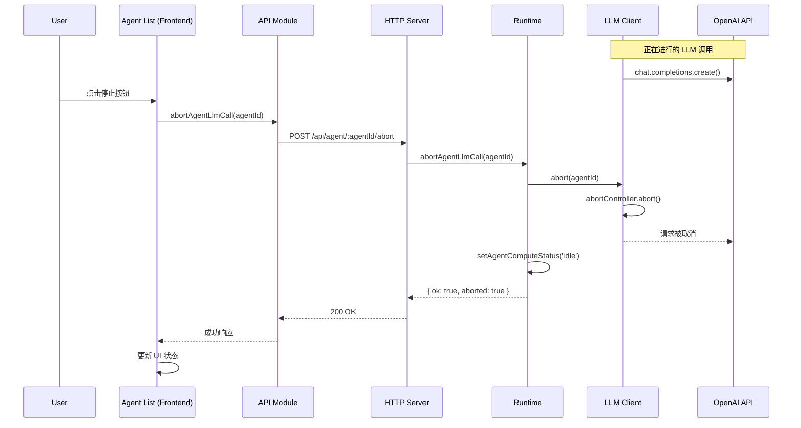

# Design Document: LLM Call Abort Feature

## Overview

本设计实现智能体大模型调用的中断机制。通过在前端智能体列表中添加停止按钮，用户可以中断正在等待 LLM 响应的智能体。后端使用 AbortController 机制取消正在进行的 HTTP 请求，确保资源及时释放。

## Architecture



## Components and Interfaces

### 1. LLM Client 扩展

在 `LlmClient` 类中添加 AbortController 支持：

```javascript
// src/platform/llm_client.js

class LlmClient {
  constructor(options) {
    // ... existing code ...
    this._activeRequests = new Map(); // agentId -> AbortController
  }

  /**
   * 调用聊天补全（支持中断）
   * @param {{messages:any[], tools?:any[], temperature?:number, meta?:any}} input
   * @returns {Promise<any>} message
   */
  async chat(input) {
    const agentId = input?.meta?.agentId ?? null;
    const abortController = new AbortController();
    
    if (agentId) {
      this._activeRequests.set(agentId, abortController);
    }
    
    try {
      return await this._chatWithRetry(input, this.maxRetries, abortController.signal);
    } finally {
      if (agentId) {
        this._activeRequests.delete(agentId);
      }
    }
  }

  /**
   * 中断指定智能体的 LLM 调用
   * @param {string} agentId
   * @returns {boolean} 是否成功中断
   */
  abort(agentId) {
    const controller = this._activeRequests.get(agentId);
    if (controller) {
      controller.abort();
      this._activeRequests.delete(agentId);
      return true;
    }
    return false;
  }

  /**
   * 检查指定智能体是否有活跃的 LLM 调用
   * @param {string} agentId
   * @returns {boolean}
   */
  hasActiveRequest(agentId) {
    return this._activeRequests.has(agentId);
  }
}
```

### 2. Runtime 扩展

在 `Runtime` 类中添加中断方法：

```javascript
// src/platform/runtime.js

class Runtime {
  /**
   * 中断指定智能体的 LLM 调用
   * @param {string} agentId
   * @returns {{ok: boolean, aborted: boolean, reason?: string}}
   */
  abortAgentLlmCall(agentId) {
    if (!agentId) {
      return { ok: false, aborted: false, reason: 'missing_agent_id' };
    }

    const agent = this._agents.get(agentId);
    if (!agent) {
      return { ok: false, aborted: false, reason: 'agent_not_found' };
    }

    const currentStatus = this.getAgentComputeStatus(agentId);
    if (currentStatus !== 'waiting_llm') {
      return { ok: true, aborted: false, reason: 'not_waiting_llm' };
    }

    const aborted = this.llm?.abort(agentId) ?? false;
    
    if (aborted) {
      this.setAgentComputeStatus(agentId, 'idle');
      void this.log.info("LLM 调用已中断", { agentId });
    }

    return { ok: true, aborted };
  }
}
```

### 3. HTTP Server 扩展

添加中断 API 端点：

```javascript
// src/platform/http_server.js

// 在 _handleRequest 方法中添加路由
if (method === "POST" && pathname.startsWith("/api/agent/") && pathname.endsWith("/abort")) {
  const match = pathname.match(/^\/api\/agent\/(.+)\/abort$/);
  if (match) {
    const agentId = decodeURIComponent(match[1]);
    this._handleAbortLlmCall(agentId, res);
  }
}

/**
 * 处理 POST /api/agent/:agentId/abort - 中断智能体的 LLM 调用
 * @param {string} agentId
 * @param {import("node:http").ServerResponse} res
 */
_handleAbortLlmCall(agentId, res) {
  if (!this.society || !this.society.runtime) {
    this._sendJson(res, 500, { error: "society_not_initialized" });
    return;
  }

  const result = this.society.runtime.abortAgentLlmCall(agentId);
  
  if (!result.ok) {
    const statusCode = result.reason === 'agent_not_found' ? 404 : 400;
    this._sendJson(res, statusCode, { error: result.reason });
    return;
  }

  void this.log.info("处理 LLM 中断请求", { agentId, aborted: result.aborted });
  this._sendJson(res, 200, { ok: true, agentId, aborted: result.aborted });
}
```

### 4. API 模块扩展

```javascript
// web/js/api.js

const API = {
  // ... existing methods ...

  /**
   * 中断指定智能体的 LLM 调用
   * @param {string} agentId - 智能体 ID
   * @returns {Promise<{ok: boolean, agentId: string, aborted: boolean}>}
   */
  async abortAgentLlmCall(agentId) {
    return this.post(`/agent/${encodeURIComponent(agentId)}/abort`, {});
  }
};
```

### 5. Agent List 组件扩展

```javascript
// web/js/components/agent-list.js

const AgentList = {
  // ... existing code ...

  /**
   * 渲染运算状态指示器（含停止按钮）
   * @param {object} agent - 智能体对象
   * @returns {string} HTML 字符串
   */
  renderComputeStatus(agent) {
    const computeStatus = agent.computeStatus;
    if (!computeStatus || computeStatus === 'idle') {
      return '';
    }
    
    if (computeStatus === 'waiting_llm') {
      return `
        <span class="compute-status waiting" title="等待大模型响应">⏳</span>
        <button class="abort-btn" 
                onclick="event.stopPropagation(); AgentList.abortLlmCall('${agent.id}')" 
                title="停止调用">⏹</button>
      `;
    }
    
    if (computeStatus === 'processing') {
      return '<span class="compute-status processing" title="处理中">⚙️</span>';
    }
    
    return '';
  },

  /**
   * 中断智能体的 LLM 调用
   * @param {string} agentId - 智能体 ID
   */
  async abortLlmCall(agentId) {
    try {
      const result = await API.abortAgentLlmCall(agentId);
      if (result.aborted) {
        Toast.show('已停止 LLM 调用', 'success');
      } else {
        Toast.show('当前没有进行中的 LLM 调用', 'info');
      }
    } catch (error) {
      console.error('中断 LLM 调用失败:', error);
      Toast.show('停止调用失败: ' + error.message, 'error');
    }
  }
};
```

### 6. CSS 样式

```css
/* web/css/style.css */

.abort-btn {
  background: #ff4444;
  color: white;
  border: none;
  border-radius: 4px;
  padding: 2px 6px;
  margin-left: 4px;
  cursor: pointer;
  font-size: 12px;
  line-height: 1;
  transition: background-color 0.2s;
}

.abort-btn:hover {
  background: #cc0000;
}

.abort-btn:active {
  background: #990000;
}
```

## Data Models

### AbortController 映射

```typescript
// LlmClient 内部状态
interface ActiveRequests {
  [agentId: string]: AbortController;
}
```

### API 响应格式

```typescript
// POST /api/agent/:agentId/abort 响应
interface AbortResponse {
  ok: boolean;
  agentId: string;
  aborted: boolean;  // true 表示成功中断，false 表示没有活跃的调用
  error?: string;    // 错误时的错误码
}
```

## Correctness Properties

*A property is a characteristic or behavior that should hold true across all valid executions of a system-essentially, a formal statement about what the system should do. Properties serve as the bridge between human-readable specifications and machine-verifiable correctness guarantees.*

### Property 1: 停止按钮可见性

*For any* agent object, the stop button is visible in the rendered HTML if and only if the agent's computeStatus is 'waiting_llm'.

**Validates: Requirements 1.1, 1.2**

### Property 2: AbortController 生命周期一致性

*For any* LLM chat call with a valid agentId, the AbortController SHALL be added to _activeRequests before the HTTP request starts and removed after the request completes (success, failure, or abort).

**Validates: Requirements 4.1, 4.2**

### Property 3: 中断后状态正确性

*For any* successful abort operation on an agent with an active LLM call, the agent's computeStatus SHALL be 'idle' after the abort completes, and the agent SHALL remain capable of receiving new messages.

**Validates: Requirements 4.3, 5.1**

### Property 4: 无活跃调用时的幂等性

*For any* abort request when no LLM call is in progress for the specified agent, the operation SHALL return success with aborted=false and SHALL NOT modify any agent state.

**Validates: Requirements 4.5**

### Property 5: 对话历史完整性

*For any* abort operation (whether during request or response phase), the agent's conversation history SHALL NOT be corrupted, and any partial response data SHALL be discarded.

**Validates: Requirements 5.2, 5.3**

### Property 6: API 端点验证

*For any* abort API request, if the specified agentId does not correspond to an existing agent, the HTTP_Server SHALL return a 404 status code.

**Validates: Requirements 3.2, 3.3**

## Error Handling

### 错误场景

| 场景 | HTTP 状态码 | 错误码 | 处理方式 |
|------|------------|--------|----------|
| 智能体不存在 | 404 | agent_not_found | 返回错误，前端显示提示 |
| 缺少 agentId | 400 | missing_agent_id | 返回错误 |
| Runtime 未初始化 | 500 | society_not_initialized | 返回错误 |
| 网络请求失败 | - | - | 前端显示错误 Toast |

### 异常恢复

1. **AbortError 处理**: 当 fetch 请求被中断时，会抛出 AbortError，需要在 LlmClient 中捕获并正确处理
2. **状态一致性**: 无论中断成功与否，都要确保 _activeRequests 映射被正确清理
3. **重试逻辑**: 中断的请求不应触发重试机制

## Testing Strategy

### 单元测试

1. **LlmClient.abort()**: 测试中断方法能正确调用 AbortController.abort()
2. **LlmClient.hasActiveRequest()**: 测试活跃请求检查
3. **Runtime.abortAgentLlmCall()**: 测试各种边界情况（智能体不存在、非 waiting_llm 状态等）
4. **HTTP Server 路由**: 测试 /api/agent/:agentId/abort 端点

### 属性测试

使用 fast-check 进行属性测试：

1. **Property 1**: 验证 AbortController 生命周期
2. **Property 2**: 验证中断后状态
3. **Property 3**: 验证幂等性
4. **Property 4**: 验证并发安全性

### 集成测试

1. 模拟完整的中断流程：前端点击 → API 调用 → 后端处理 → 状态更新
2. 测试中断后智能体能正常接收新消息
