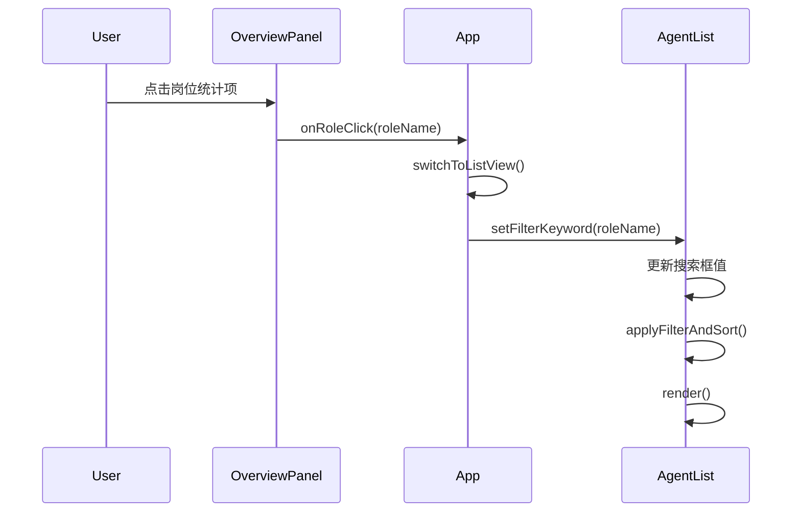

# Design Document: Overview Role Click Filter

## Overview

本设计实现在总览视图中点击岗位统计项时，自动切换到列表视图并按该岗位名称进行筛选的功能。该功能涉及三个组件的协作：OverviewPanel（触发点击事件）、App（协调视图切换和状态传递）、AgentList（接收筛选关键词并更新显示）。

## Architecture



## Components and Interfaces

### OverviewPanel 组件修改

新增岗位点击处理方法：

```javascript
/**
 * 岗位统计项点击处理
 * @param {string} roleName - 岗位名称
 */
onRoleClick(roleName) {
  if (window.App) {
    window.App.switchToListViewWithFilter(roleName);
  }
}
```

修改 `renderRoleStats()` 方法，为岗位统计项添加点击事件：

```javascript
const statsHtml = statsArray.map(stat => `
  <div class="role-stat-item" onclick="OverviewPanel.onRoleClick('${this.escapeHtml(stat.name)}')">
    <span class="role-stat-name">${this.escapeHtml(stat.name)}</span>
    <span class="role-stat-count">${stat.count}</span>
  </div>
`).join('');
```

### App 模块修改

新增带筛选的视图切换方法：

```javascript
/**
 * 切换到列表视图并设置筛选关键词
 * @param {string} filterKeyword - 筛选关键词（岗位名称）
 */
switchToListViewWithFilter(filterKeyword) {
  this.switchToListView();
  AgentList.setFilterKeyword(filterKeyword);
}
```

### AgentList 组件修改

新增设置筛选关键词的方法：

```javascript
/**
 * 设置筛选关键词（供外部调用）
 * @param {string} keyword - 筛选关键词
 */
setFilterKeyword(keyword) {
  this.filterKeyword = keyword || '';
  
  // 同步更新搜索框
  if (this.searchInput) {
    this.searchInput.value = this.filterKeyword;
  }
  
  this.applyFilterAndSort();
  this.render();
}
```

## Data Models

无新增数据模型。使用现有的：
- `agent.roleName` - 智能体岗位名称
- `AgentList.filterKeyword` - 筛选关键词状态

## Correctness Properties

*A property is a characteristic or behavior that should hold true across all valid executions of a system-essentially, a formal statement about what the system should do. Properties serve as the bridge between human-readable specifications and machine-verifiable correctness guarantees.*

### Property 1: Role click triggers view switch with filter

*For any* role name clicked in the overview panel, calling `switchToListViewWithFilter(roleName)` SHALL result in:
1. The current view being set to 'list'
2. The AgentList filter keyword being set to the role name

**Validates: Requirements 1.1, 1.2, 1.3**

### Property 2: Filter keyword synchronizes with search input

*For any* filter keyword set via `setFilterKeyword(keyword)`, the search input element's value SHALL equal the keyword.

**Validates: Requirements 1.4, 3.1**

### Property 3: Filter correctly filters agents by role

*For any* filter keyword and agent list, after applying the filter, all displayed agents SHALL have a roleName that contains the filter keyword (case-insensitive).

**Validates: Requirements 1.5, 3.2**

## Error Handling

1. **空岗位名称**: 如果岗位名称为空或 undefined，`setFilterKeyword` 将其转换为空字符串，显示所有智能体
2. **特殊字符**: 岗位名称中的特殊字符通过 `escapeHtml` 进行转义，防止 XSS 攻击
3. **组件未初始化**: 在调用方法前检查 `window.App` 和 `this.searchInput` 是否存在

## Testing Strategy

### Unit Tests
- 测试 `setFilterKeyword` 方法正确更新 `filterKeyword` 状态
- 测试 `switchToListViewWithFilter` 方法正确调用视图切换和筛选设置
- 测试 CSS hover 样式是否正确定义

### Property-Based Tests
使用 fast-check 库进行属性测试：

1. **Property 1 测试**: 生成随机岗位名称，验证视图切换和筛选状态
2. **Property 2 测试**: 生成随机关键词，验证搜索框同步
3. **Property 3 测试**: 生成随机智能体列表和筛选关键词，验证筛选结果正确性

每个属性测试运行至少 100 次迭代。
