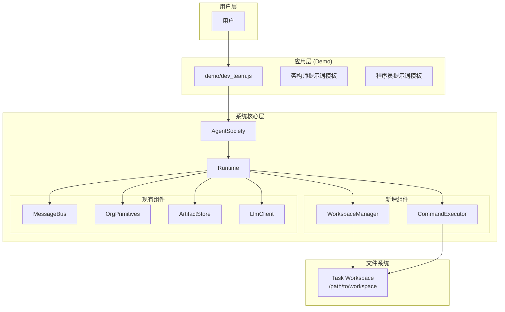
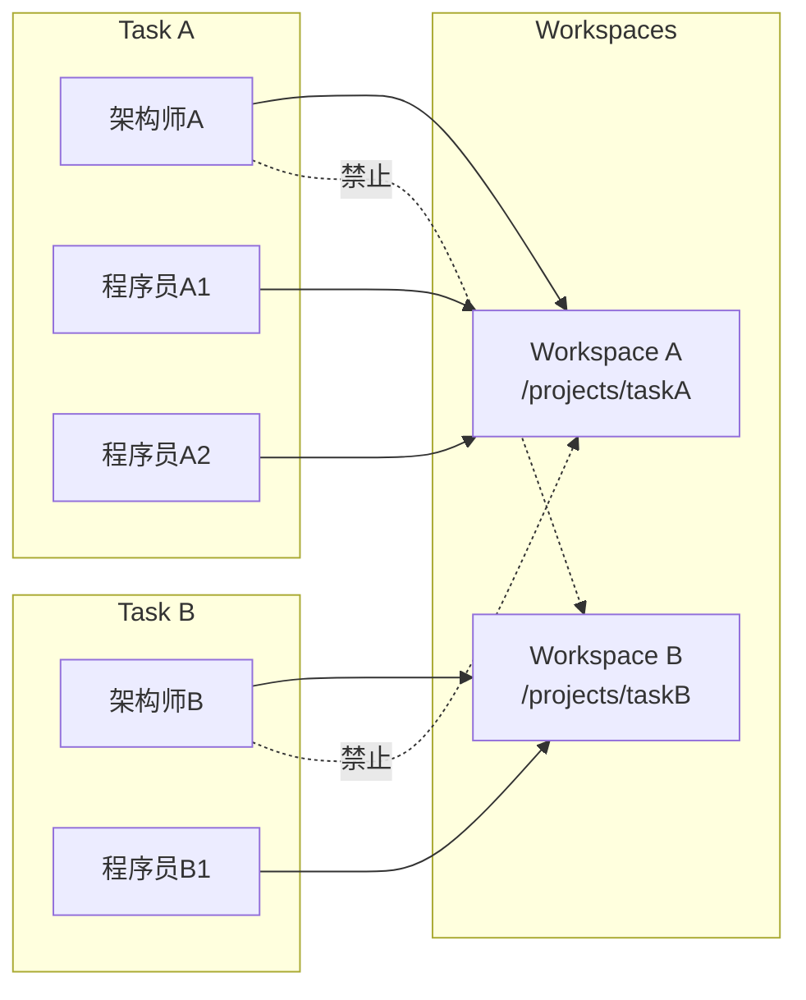

# 设计文档

## 概述

本设计文档描述了为自组织AI Agent社会系统添加"任务工作空间"和"沙箱终端"通用能力的技术方案，以及基于这些能力构建"自组织编程团队"demo的设计。

系统扩展分为两层：
1. **系统核心层**：在Runtime中添加文件访问和命令执行的通用工具
2. **应用层**：在demo代码中定义架构师和程序员的提示词模板

## 架构

### 整体架构图



### 工作空间隔离模型



## 组件与接口

### 1. WorkspaceManager（新增组件）

负责管理任务工作空间的文件操作，确保安全隔离。

```javascript
/**
 * 工作空间管理器
 * 负责任务工作空间的文件操作，确保路径安全
 */
class WorkspaceManager {
  /**
   * @param {{logger?: ModuleLogger}} options
   */
  constructor(options = {}) {
    this._workspaces = new Map(); // taskId -> workspacePath
    this.log = options.logger ?? createNoopModuleLogger();
  }

  /**
   * 为任务绑定工作空间
   * @param {string} taskId
   * @param {string} workspacePath - 绝对路径
   * @returns {Promise<{ok: boolean, error?: string}>}
   */
  async bindWorkspace(taskId, workspacePath) { }

  /**
   * 获取任务的工作空间路径
   * @param {string} taskId
   * @returns {string|null}
   */
  getWorkspacePath(taskId) { }

  /**
   * 读取文件内容
   * @param {string} taskId
   * @param {string} relativePath - 相对于工作空间的路径
   * @returns {Promise<{content?: string, error?: string}>}
   */
  async readFile(taskId, relativePath) { }

  /**
   * 写入文件内容
   * @param {string} taskId
   * @param {string} relativePath
   * @param {string} content
   * @returns {Promise<{ok: boolean, error?: string}>}
   */
  async writeFile(taskId, relativePath, content) { }

  /**
   * 列出目录内容
   * @param {string} taskId
   * @param {string} relativePath - 默认为 "."
   * @returns {Promise<{files?: Array<{name: string, type: 'file'|'directory', size: number}>, error?: string}>}
   */
  async listFiles(taskId, relativePath = ".") { }

  /**
   * 获取工作空间信息
   * @param {string} taskId
   * @returns {Promise<{fileCount: number, dirCount: number, totalSize: number, lastModified: string}|{error: string}>}
   */
  async getWorkspaceInfo(taskId) { }

  /**
   * 验证路径是否在工作空间内（防止路径遍历攻击）
   * @param {string} workspacePath
   * @param {string} targetPath
   * @returns {boolean}
   */
  _isPathSafe(workspacePath, targetPath) { }
}
```

### 2. CommandExecutor（新增组件）

负责在工作空间内安全执行终端命令。

```javascript
/**
 * 命令执行器
 * 在工作空间内安全执行终端命令
 */
class CommandExecutor {
  /**
   * @param {{logger?: ModuleLogger, defaultTimeoutMs?: number}} options
   */
  constructor(options = {}) {
    this.defaultTimeoutMs = options.defaultTimeoutMs ?? 60000;
    this.log = options.logger ?? createNoopModuleLogger();
    this._blockedCommands = [
      'rm -rf /',
      'sudo',
      'su ',
      'chmod 777',
      'mkfs',
      'dd if=',
      '> /dev/',
      'shutdown',
      'reboot',
      'init 0',
      'init 6'
    ];
  }

  /**
   * 执行命令
   * @param {string} workspacePath - 工作目录
   * @param {string} command - 要执行的命令
   * @param {{timeoutMs?: number}} options
   * @returns {Promise<{stdout: string, stderr: string, exitCode: number}|{error: string, timedOut?: boolean}>}
   */
  async execute(workspacePath, command, options = {}) { }

  /**
   * 检查命令是否被禁止
   * @param {string} command
   * @returns {{blocked: boolean, reason?: string}}
   */
  _checkCommandSafety(command) { }
}
```

### 3. Runtime 扩展

在现有 Runtime 中添加新的工具定义和执行逻辑。

#### 新增工具定义

```javascript
// 在 getToolDefinitions() 中添加
{
  type: "function",
  function: {
    name: "read_file",
    description: "读取工作空间内的文件内容。只能访问当前任务绑定的工作空间内的文件。",
    parameters: {
      type: "object",
      properties: {
        path: { 
          type: "string", 
          description: "文件的相对路径（相对于工作空间根目录）" 
        }
      },
      required: ["path"]
    }
  }
},
{
  type: "function",
  function: {
    name: "write_file",
    description: "在工作空间内创建或修改文件。只能在当前任务绑定的工作空间内写入。",
    parameters: {
      type: "object",
      properties: {
        path: { 
          type: "string", 
          description: "文件的相对路径（相对于工作空间根目录）" 
        },
        content: { 
          type: "string", 
          description: "文件内容" 
        }
      },
      required: ["path", "content"]
    }
  }
},
{
  type: "function",
  function: {
    name: "list_files",
    description: "列出工作空间内指定目录的文件和子目录。",
    parameters: {
      type: "object",
      properties: {
        path: { 
          type: "string", 
          description: "目录的相对路径，默认为根目录" 
        }
      }
    }
  }
},
{
  type: "function",
  function: {
    name: "run_command",
    description: "在工作空间内执行终端命令。命令将在工作空间目录下执行。",
    parameters: {
      type: "object",
      properties: {
        command: { 
          type: "string", 
          description: "要执行的命令" 
        },
        timeoutMs: { 
          type: "number", 
          description: "超时时间（毫秒），默认60000" 
        }
      },
      required: ["command"]
    }
  }
},
{
  type: "function",
  function: {
    name: "get_workspace_info",
    description: "获取当前工作空间的状态信息。",
    parameters: {
      type: "object",
      properties: {}
    }
  }
}
```

### 4. AgentSociety 扩展

扩展 submitRequirement 方法以支持工作空间绑定。

```javascript
/**
 * 提交自然语言需求描述给根智能体
 * @param {string} text - 需求文本
 * @param {{workspacePath?: string}} options - 可选参数
 * @returns {Promise<{taskId: string, workspacePath?: string}>}
 */
async submitRequirement(text, options = {}) {
  const taskId = randomUUID();
  
  // 如果指定了工作空间，绑定到任务
  if (options.workspacePath) {
    const result = await this.runtime.workspaceManager.bindWorkspace(
      taskId, 
      options.workspacePath
    );
    if (!result.ok) {
      return { error: result.error };
    }
  }
  
  // ... 现有逻辑
}
```

## 数据模型

### 工作空间绑定

```javascript
// 存储在 WorkspaceManager._workspaces 中
{
  taskId: "uuid-xxx",
  workspacePath: "/absolute/path/to/workspace",
  createdAt: "2026-01-05T10:00:00.000+08:00"
}
```

### 文件列表响应

```javascript
{
  files: [
    { name: "src", type: "directory", size: 0 },
    { name: "package.json", type: "file", size: 1234 },
    { name: "README.md", type: "file", size: 567 }
  ]
}
```

### 命令执行响应

```javascript
// 成功
{
  stdout: "test output\n",
  stderr: "",
  exitCode: 0
}

// 失败
{
  error: "command_blocked",
  reason: "危险命令被禁止: sudo"
}

// 超时
{
  error: "command_timeout",
  timedOut: true,
  timeoutMs: 60000
}
```

## 正确性属性

*正确性属性是系统应该满足的形式化规范，用于指导属性测试。每个属性都是一个普遍量化的陈述，描述了系统在所有有效输入下应该表现的行为。*

### Property 1: 路径安全验证
*For any* 工作空间路径和任意相对路径输入，如果相对路径包含 `..` 或绝对路径前缀，则文件操作应被拒绝并返回错误
**Validates: Requirements 9.6, 9.8**

### Property 2: 文件操作 Round-Trip
*For any* 有效的文件路径和内容，write_file 写入后 read_file 读取应返回相同的内容
**Validates: Requirements 9.3, 9.4**

### Property 3: 工作空间隔离
*For any* 两个不同的 taskId，它们的工作空间应该相互隔离，一个任务的智能体不能访问另一个任务的文件
**Validates: Requirements 9.2, 9.6**

### Property 4: 目录列表完整性
*For any* 工作空间，list_files 返回的文件列表应包含该目录下所有实际存在的文件和子目录
**Validates: Requirements 9.5**

### Property 5: 危险命令拦截
*For any* 包含危险关键词的命令（如 sudo、rm -rf /），run_command 应拒绝执行并返回错误
**Validates: Requirements 10.5**

### Property 6: 命令执行超时
*For any* 执行时间超过超时限制的命令，run_command 应在超时后终止命令并返回超时错误
**Validates: Requirements 10.4, 10.6**

### Property 7: 命令结果完整性
*For any* 成功执行的命令，run_command 返回的结果应包含 stdout、stderr 和 exitCode 三个字段
**Validates: Requirements 10.3**

### Property 8: 工作空间自动创建
*For any* 不存在的工作空间路径，bindWorkspace 应自动创建该目录
**Validates: Requirements 11.3**

### Property 9: 工作空间信息准确性
*For any* 工作空间，get_workspace_info 返回的文件数量和目录数量应与实际一致
**Validates: Requirements 11.1, 11.2**

## 错误处理

### 文件操作错误

| 错误码 | 描述 | 处理方式 |
|--------|------|----------|
| `path_traversal_blocked` | 路径遍历攻击被拦截 | 返回错误，记录警告日志 |
| `file_not_found` | 文件不存在 | 返回错误 |
| `permission_denied` | 无权限访问 | 返回错误 |
| `workspace_not_bound` | 任务未绑定工作空间 | 返回错误，提示需要先绑定 |

### 命令执行错误

| 错误码 | 描述 | 处理方式 |
|--------|------|----------|
| `command_blocked` | 危险命令被拦截 | 返回错误，记录警告日志 |
| `command_timeout` | 命令执行超时 | 终止进程，返回超时错误 |
| `command_failed` | 命令执行失败 | 返回 stderr 和退出码 |

## 测试策略

### 单元测试

1. **WorkspaceManager 测试**
   - 路径安全验证（各种路径遍历尝试）
   - 文件读写操作
   - 目录列表
   - 工作空间信息查询

2. **CommandExecutor 测试**
   - 危险命令拦截
   - 命令超时处理
   - 正常命令执行

### 属性测试

使用 fast-check 库进行属性测试，每个属性至少运行 100 次迭代。

```javascript
// 示例：路径安全验证属性测试
import fc from 'fast-check';

describe('WorkspaceManager', () => {
  it('Property 1: 路径安全验证', () => {
    fc.assert(
      fc.property(
        fc.string(), // 任意字符串作为路径
        (path) => {
          const result = manager._isPathSafe('/workspace', path);
          if (path.includes('..') || path.startsWith('/')) {
            return result === false;
          }
          return true;
        }
      ),
      { numRuns: 100 }
    );
  });
});
```

### 集成测试

1. 端到端工作流测试：创建任务 → 绑定工作空间 → 文件操作 → 命令执行
2. 多任务隔离测试：验证不同任务的工作空间相互隔离

---

## 应用层设计：编程团队 Demo

### 架构师提示词模板

```javascript
const ARCHITECT_ROLE_PROMPT = `
你是一名软件架构师，负责：
1. 与用户沟通需求，澄清不明确的地方
2. 设计系统架构，确保模块化、高内聚低耦合
3. 将系统分解为子模块，每个模块代码量控制在500行以内
4. 为每个模块创建程序员智能体，分配开发任务
5. 收集模块代码，进行集成和交付

【模块分解原则】
- 每个模块只负责单一职责
- 模块之间通过清晰的接口通信
- 每个模块的代码不超过500行
- 如果模块过于复杂（预估超过2000行），创建子架构师进一步分解

【程序员管理】
- 为每个模块创建一个程序员岗位和智能体
- 向程序员发送模块规格说明（接口定义、输入输出、依赖关系）
- 收到程序员完成汇报后，检查代码质量
- 任务完成后调用 terminate_agent 终止程序员智能体

【文件操作】
- 使用 list_files 查看工作空间结构
- 使用 read_file 读取现有代码
- 使用 write_file 创建架构文档
- 使用 run_command 执行测试和构建命令

【进度汇报】
- 架构设计完成后向用户汇报方案
- 模块开发完成后向用户汇报进度
- 集成完成后向用户交付成果

【与用户沟通】
- 需要向用户反馈时：send_message(to="user", payload={text: "..."})
- 需要澄清需求时：主动向用户提问
`;
```

### 程序员提示词模板

```javascript
const PROGRAMMER_ROLE_PROMPT = `
你是一名程序员，负责开发分配给你的模块。

【开发规范】
- 严格按照模块规格说明开发
- 确保代码符合接口定义
- 单个文件不超过500行
- 添加必要的注释

【文件操作】
- 使用 write_file 创建代码文件
- 使用 read_file 查看相关文件
- 使用 run_command 执行测试

【质量要求】
- 代码完成后进行自测
- 如果模块过于复杂需要超过500行，向架构师申请拆分

【汇报规范】
- 开发完成后向架构师汇报
- 汇报内容包括：完成的文件列表、测试结果、遇到的问题
- 汇报后停止调用工具，等待下一步指示
`;
```

### Demo 入口代码结构

```javascript
// demo/dev_team.js
import { AgentSociety } from "../src/platform/agent_society.js";

const ARCHITECT_ROLE_PROMPT = `...`;
const PROGRAMMER_ROLE_PROMPT = `...`;

function buildDevTeamRequirement(userRequirement) {
  return `
【任务目标】
创建一个软件架构师智能体来处理以下编程需求：

${userRequirement}

【架构师职责】
${ARCHITECT_ROLE_PROMPT}

【程序员岗位模板】
当创建程序员岗位时，使用以下提示词：
${PROGRAMMER_ROLE_PROMPT}
  `.trim();
}

async function main() {
  const system = new AgentSociety({ dataDir: "data/dev_team" });
  await system.init();
  
  // 用户指定工作空间
  const workspacePath = process.argv[2] || "./workspace";
  const userRequirement = process.argv[3] || "创建一个简单的计算器程序";
  
  const { taskId } = await system.submitRequirement(
    buildDevTeamRequirement(userRequirement),
    { workspacePath }
  );
  
  // ... 交互循环
}
```
