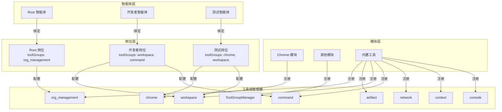

# 设计文档

## 概述

本设计实现工具函数的分组管理机制。核心思想是：
1. 每个模块向工具组管理器提供一组工具
2. 运行时提供内置工具组
3. 岗位可以配置使用哪些工具组
4. 智能体只能看到和调用其岗位配置的工具

## 架构



## 组件和接口

### ToolGroupManager 类

工具组管理器是核心组件，负责管理所有工具组的注册、查询和工具定义获取。

```javascript
/**
 * 工具组管理器
 */
class ToolGroupManager {
  constructor(options = {}) {
    this.log = options.logger ?? createNoopModuleLogger();
    this._groups = new Map();           // groupId -> ToolGroup
    this._toolToGroup = new Map();      // toolName -> groupId
    this._reservedGroupIds = new Set(); // 保留的工具组标识符
  }

  /**
   * 注册工具组
   * @param {string} groupId - 工具组标识符
   * @param {object} groupDef - 工具组定义
   * @param {string} groupDef.description - 工具组描述
   * @param {Array} groupDef.tools - 工具定义列表
   * @param {boolean} [isReserved=false] - 是否为保留工具组
   * @returns {{ok: boolean, error?: string}}
   */
  registerGroup(groupId, groupDef, isReserved = false) { }

  /**
   * 注销工具组
   * @param {string} groupId - 工具组标识符
   * @returns {{ok: boolean, error?: string}}
   */
  unregisterGroup(groupId) { }

  /**
   * 获取指定工具组的工具定义
   * @param {string[]} groupIds - 工具组标识符数组
   * @returns {Array} 合并后的工具定义列表（去重）
   */
  getToolDefinitions(groupIds) { }

  /**
   * 列出所有工具组
   * @returns {Array<{id: string, description: string, toolCount: number, tools: string[]}>}
   */
  listGroups() { }

  /**
   * 获取工具所属的工具组
   * @param {string} toolName - 工具名称
   * @returns {string|null} 工具组标识符
   */
  getToolGroup(toolName) { }

  /**
   * 检查工具是否在指定工具组中
   * @param {string} toolName - 工具名称
   * @param {string[]} groupIds - 工具组标识符数组
   * @returns {boolean}
   */
  isToolInGroups(toolName, groupIds) { }

  /**
   * 获取所有工具组标识符
   * @returns {string[]}
   */
  getAllGroupIds() { }
}
```

### 模块接口扩展

模块需要提供工具组信息：

```javascript
// 模块导出接口
export default {
  name: "chrome",
  
  // 新增：工具组标识符（可选，默认使用模块名）
  toolGroupId: "chrome",
  
  // 新增：工具组描述
  toolGroupDescription: "Chrome 浏览器控制工具",
  
  // 现有方法
  getToolDefinitions() { },
  executeToolCall(ctx, toolName, args) { },
  init(runtime, config) { },
  shutdown() { }
};
```

### 岗位数据结构扩展

```javascript
// 岗位元数据
{
  id: "role-uuid",
  name: "开发者",
  rolePrompt: "你是一个开发者...",
  createdBy: "root",
  createdAt: "2026-01-11T...",
  status: "active",
  llmServiceId: null,
  // 新增字段
  toolGroups: ["workspace", "command", "artifact"]  // 工具组标识符数组
}
```

### Runtime 集成

```javascript
class Runtime {
  constructor(options) {
    // ...
    this.toolGroupManager = new ToolGroupManager();
  }

  async init() {
    // 注册内置工具组
    this._registerBuiltinToolGroups();
    
    // 加载模块时注册模块工具组
    await this.moduleLoader.loadModules(this.config.modules, this);
  }

  /**
   * 获取智能体可用的工具定义
   * @param {string} agentId - 智能体ID
   * @returns {Array} 工具定义列表
   */
  getToolDefinitionsForAgent(agentId) {
    const agent = this._agents.get(agentId);
    if (!agent) return [];
    
    const role = this.org.getRole(agent.roleId);
    if (!role) return [];
    
    // root 岗位硬编码只有 org_management
    if (agent.id === "root") {
      return this.toolGroupManager.getToolDefinitions(["org_management"]);
    }
    
    // 获取岗位配置的工具组，未配置则使用全部
    const toolGroups = role.toolGroups ?? this.toolGroupManager.getAllGroupIds();
    return this.toolGroupManager.getToolDefinitions(toolGroups);
  }

  /**
   * 执行工具调用（带权限检查）
   * @param {any} ctx - 上下文
   * @param {string} toolName - 工具名称
   * @param {any} args - 参数
   * @returns {Promise<any>}
   */
  async executeToolCall(ctx, toolName, args) {
    const agentId = ctx.agent?.id;
    const role = this.org.getRole(ctx.agent?.roleId);
    
    // root 岗位硬编码只有 org_management
    const toolGroups = agentId === "root" 
      ? ["org_management"]
      : (role?.toolGroups ?? this.toolGroupManager.getAllGroupIds());
    
    // 检查工具是否在允许的工具组中
    if (!this.toolGroupManager.isToolInGroups(toolName, toolGroups)) {
      return {
        error: "tool_not_available",
        toolName,
        message: `工具 ${toolName} 对此岗位不可用`
      };
    }
    
    // 执行工具调用
    // ...
  }
}
```

## 数据模型

### 工具组定义

```typescript
interface ToolGroup {
  id: string;                    // 工具组标识符
  description: string;           // 工具组描述
  tools: ToolDefinition[];       // 工具定义列表
  isReserved: boolean;           // 是否为保留工具组
  registeredAt: string;          // 注册时间
}

interface ToolDefinition {
  type: "function";
  function: {
    name: string;
    description: string;
    parameters: object;
  };
}
```

### 内置工具组定义

```javascript
const BUILTIN_TOOL_GROUPS = {
  org_management: {
    description: "组织管理工具",
    tools: ["find_role_by_name", "create_role", "spawn_agent", 
            "spawn_agent_with_task", "terminate_agent", "send_message"]
  },
  artifact: {
    description: "工件管理工具",
    tools: ["put_artifact", "get_artifact"]
  },
  workspace: {
    description: "工作空间工具",
    tools: ["read_file", "write_file", "list_files", "get_workspace_info"]
  },
  command: {
    description: "命令执行工具",
    tools: ["run_command", "run_javascript"]
  },
  network: {
    description: "网络工具",
    tools: ["http_request"]
  },
  context: {
    description: "上下文管理工具",
    tools: ["compress_context", "get_context_status"]
  },
  console: {
    description: "控制台工具",
    tools: ["console_print"]
  }
};
```

## 正确性属性

*正确性属性是系统应该在所有有效执行中保持为真的特征或行为——本质上是关于系统应该做什么的形式化陈述。属性作为人类可读规范和机器可验证正确性保证之间的桥梁。*

### 属性 1：工具组注册一致性

*对于任意*工具组注册操作，注册成功后，工具组管理器应包含该工具组，且工具组中的所有工具都应能通过 `getToolGroup` 方法找到其所属工具组。

**验证: 需求 1.1, 1.2, 1.4**

### 属性 2：工具组注销完整性

*对于任意*已注册的工具组，注销后，工具组管理器不应再包含该工具组，且该工具组中的所有工具都不应再能通过 `getToolGroup` 方法找到。

**验证: 需求 1.5**

### 属性 3：保留标识符冲突检测

*对于任意*尝试使用保留标识符注册工具组的操作，工具组管理器应拒绝注册并返回错误。

**验证: 需求 2.3**

### 属性 4：工具定义构建正确性

*对于任意*岗位配置的工具组列表，`getToolDefinitions` 返回的工具定义应：
1. 只包含配置工具组中的工具
2. 不包含重复的工具定义
3. 包含配置工具组中的所有工具

**验证: 需求 4.1, 4.2**

### 属性 5：未授权工具调用拒绝

*对于任意*智能体尝试调用不在其岗位配置工具组中的工具，运行时应返回包含工具名称的错误消息。

**验证: 需求 4.3, 4.4**

### 属性 6：工具组查询完整性

*对于任意*工具组查询操作，返回结果应包含工具组标识符、描述和正确的工具数量。

**验证: 需求 5.1, 5.2, 5.3, 5.4**

### 属性 7：岗位工具组持久化

*对于任意*岗位的工具组配置更新，保存后重新加载应得到相同的工具组配置。

**验证: 需求 3.4, 6.4**

### 属性 8：默认工具组行为

*对于任意*非 root 岗位，如果未指定 toolGroups，应返回所有可用工具组的工具定义。

**验证: 需求 3.3**

## 错误处理

### 工具组注册错误

| 错误码 | 描述 | 处理方式 |
|--------|------|----------|
| `reserved_group_id` | 尝试使用保留的工具组标识符 | 返回错误，拒绝注册 |
| `duplicate_group_id` | 工具组标识符已存在 | 返回警告，覆盖现有工具组 |
| `invalid_group_def` | 工具组定义格式无效 | 返回错误，拒绝注册 |

### 工具调用错误

| 错误码 | 描述 | 处理方式 |
|--------|------|----------|
| `tool_not_available` | 工具不在岗位配置的工具组中 | 返回错误消息，包含工具名称 |
| `unknown_tool` | 工具不存在 | 返回错误消息 |

## 测试策略

### 单元测试

1. **ToolGroupManager 测试**
   - 工具组注册/注销
   - 保留标识符检测
   - 工具定义获取
   - 工具组查询

2. **Runtime 集成测试**
   - 内置工具组初始化
   - 模块工具组注册
   - 智能体工具可见性
   - 工具调用权限检查

### 属性测试

使用 fast-check 进行属性测试，每个属性至少运行 100 次迭代。

1. **工具组注册一致性属性测试**
   - 生成随机工具组定义
   - 验证注册后的一致性

2. **工具定义构建正确性属性测试**
   - 生成随机工具组配置
   - 验证返回的工具定义正确性

3. **未授权工具调用拒绝属性测试**
   - 生成随机工具调用
   - 验证权限检查正确性
